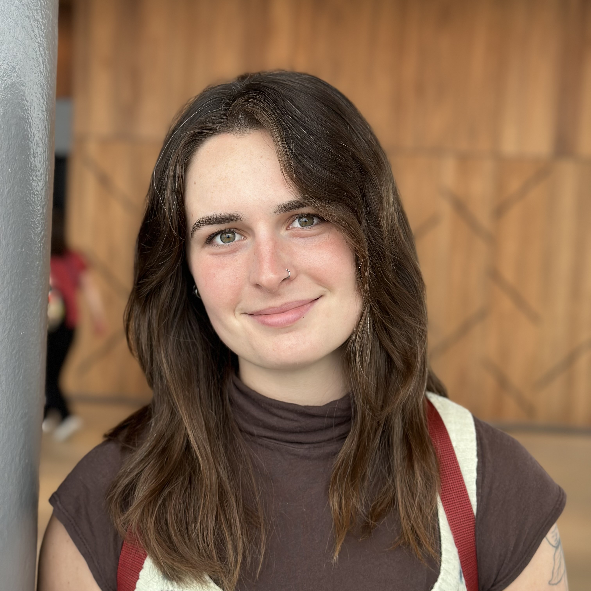

```{r setup, include=FALSE}
knitr::opts_chunk$set(echo = TRUE)
```

<div style="display: flex;">

<div style="width: 1000px;">

```{r pressure, echo=FALSE, fig.cap="Savannah H. Swinea", out.width = '80%'}

```

<style>
  .figure img {

    border-radius: 50%; /* Crops the image into a circle */
    display: block;
    margin: 0 auto; /* Centers the image */
  }
  .caption {
    text-align: center; /* Centers the caption */
    font-size: 18px; /* Set the font size of the caption */
  }
</style>

</div>

<div style="padding-left: 20px; font-size: 16px; line-height: 1.6;">

Welcome!

My research focuses on co-producing knowledge with scientists and local experts and applying that knowledge to practically benefit coastal ecosystems and societies. My work is interdisciplinary, spanning environmental and social sciences, and I use participatory approaches alongside statistical and computational methods to unpack complex modern challenges.

I am currently a Postdoctoral Researcher at North Carolina State University in partnership the United States Geological Survey (USGS) [Southeast Climate Adaptation Science Center](https://secasc.ncsu.edu/).

I received my BS in Environmental Sciences at the University of North Carolina at Chapel Hill and my PhD in Marine and Environmental Sciences at Northeastern University.

<div style="display: flex; align-items: center; gap: 10px;">
  <a href="https://scholar.google.com/citations?user=YOUR_PROFILE_ID" target="_blank">
    
  </a>

  <a href="https://twitter.com/YOUR_TWITTER_HANDLE" target="_blank">
    
  </a>

  <a href="https://github.com/YOUR_GITHUB_USERNAME" target="_blank">
    
  </a>
</div>

</div>

</div>


