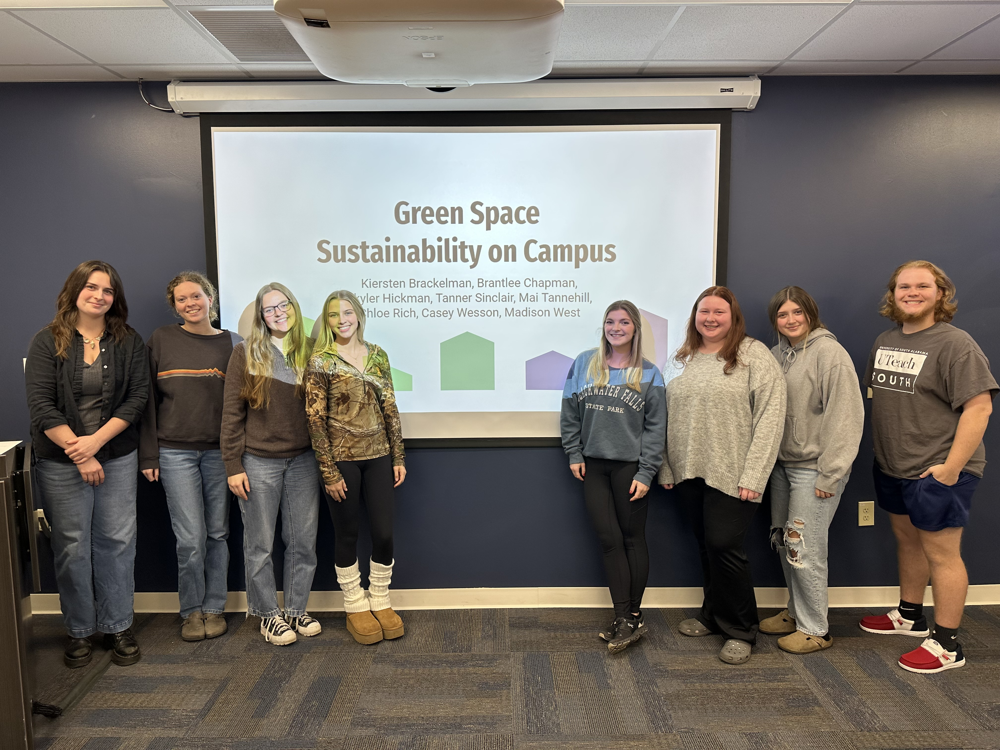

<span style="font-size: 18px;">**Teaching Experience**</span>  

Environment & Society (ENV101, University of South Alabama) - Fall 2023, 2024

This course focuses on understanding the intertwined nature of people and environments. Students will learn to see and describe the social, economic, and biophysical dimensions of environmental problems and solutions. Specific topics include:

* Resilience and ecosystem services
* Risks and hazards
* Cognition and behavior
* Sustainable materials, technologies, and development
* Commons and food systems
* History, policy, and religion

After building a foundation in the fundamentals of coupled socio-environmental systems, students apply this knowledge as researchers. Students develop and implement surveys of their university community on sustainability topics of their choosing and disseminate their findings in a conference-style presentation and report in the style of a peer-reviewed publication.

```{r setup, include=FALSE}
knitr::opts_chunk$set(echo = TRUE, fig.width = 5, fig.height = 5)
```

<div style="display: flex; justify-content: space-between; align-items: center;"> 

<!-- Left-aligned image --> 
<div style="width: 45%; text-align: center;"> 

```{r left_image, echo=FALSE, fig.cap="*Undergraduate students present their class project on recycling and food waste in Fall 2024*"}
knitr::include_graphics("class1.jpg") 
``` 

</div> 

<!-- Right-aligned image --> 
<div style="width: 45%; text-align: center;"> 

```{r right_image, echo=FALSE, fig.cap="*Undergraduate students present their class project on green space in Fall 2024*"}
 
``` 

</div> </div> 
