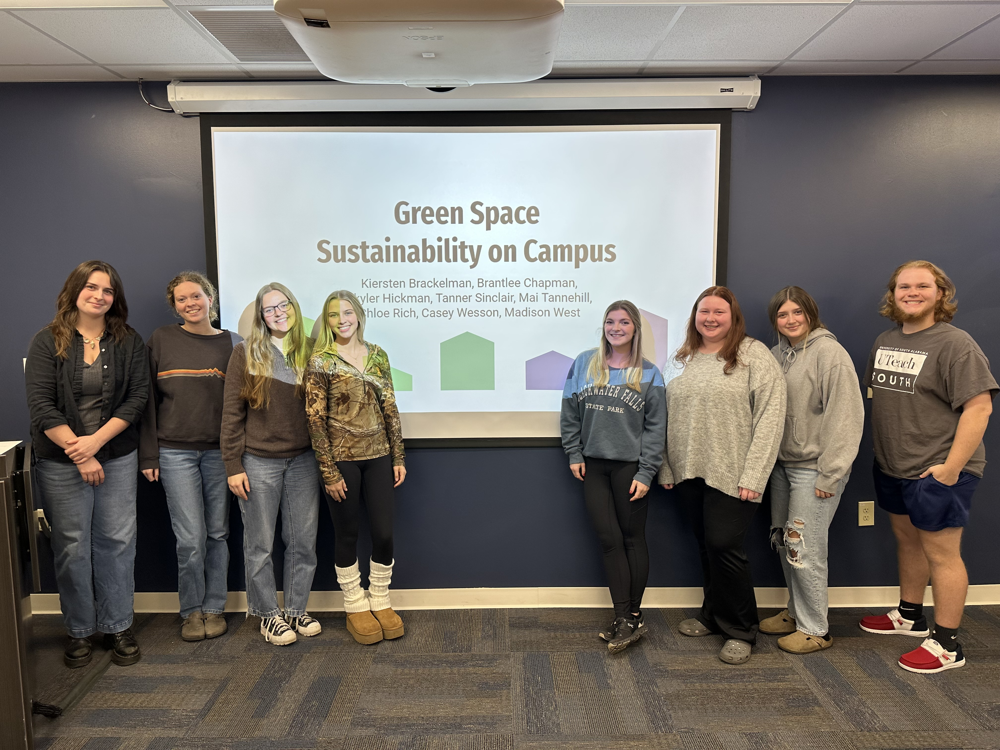

# Teaching
[About](https://shswinea.github.io/) | [Research](/research.md) | [Teaching](/teaching.md) | [DEI](/dei.md) | [News](/news.md)

Inclusive teaching is a mindset that I strive to cultivate. When we enter the classroom, we are not blank slates, and thus we are not all in the same class. We each bring unique experiences and challenges into the learning space, and centering both student and instructor identity is crucial for everyone to learn to the best of their ability.

I use dynamic lectures and activities to embody an active and experiential teaching style. I love using simulations and games to ask my students to "wear many hats" and insert themselves into situations they may encounter in the real world!

I also have an overarching goal to enhance the self-efficacy of my students through research projects. Students choose topics that are relevant and place-based, and then employ rigorous scientific principles to answer their research questions.

## Teaching Experience

**ENV101: Environment and Society**

This course focuses on understanding the intertwined nature of people and environments. Students will learn to see and describe the social, economic, and biophysical dimensions of environmental problems and solutions. Specific topics include:

* Resilience and ecosystem services
* Risks and hazards
* Cognition and behavior
* Sustainable materials, technologies, and development
* Commons and food systems
* History, policy, and religion

After building a foundation in the fundamentals of coupled socio-environmental systems, students apply this knowledge as researchers. Students develop and implement surveys of their university community on sustainability topics of their choosing and disseminate their findings in a conference-style presentation and report in the style of a peer-reviewed publication.

## Areas of Instructional Expertise

- Environment and Society
- Sustainable Development
- Environmental Sociology
- Participatory Research Methods
- Social-Ecological Systems Modeling
- Social Science Methods in R and Python
